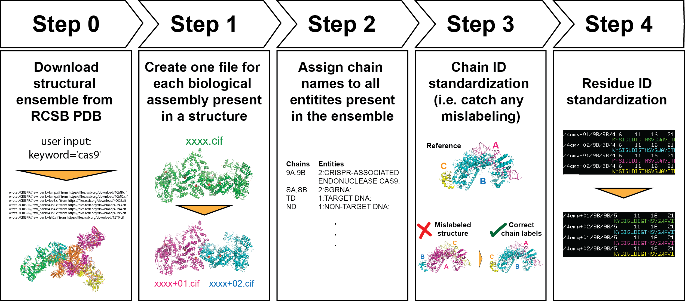

# PDBCleanV2 

With PDBCleanV2, users can create their own self-consistent structure dataset, enabling more straightforward comparison among structures. The library creates separate files for each biological assembly present in a structure file and standardizes chain names and numbering. Our goal is to provide researchers with a consistent dataset that facilitates their analysis.

## Table of contents

* [PDBCleanV2 workflow and tutorial](#pdbcleanv2-workflow)
* [Other tools](#other-tools)
* [Installation](#installation)
* [PDBClean team](#pdbclean-team)

## PDBCleanV2 Workflow

We have created Jupyter Notebooks that provide a step-by-step guide for creating a curated ensemble of structures using PDBCleanV2. 

### [Step 0. Download structural ensemble form RCSB PDB.](https://github.com/fatipardo/PDBClean-0.0.2/blob/master/Notebooks/Step0.DownloadStructuralEnsembleFromRCSBPDB.ipynb)

Download all structures that match the name and sequence of your molecule of interest.

> **Note:** This notebook sometimes does not display on the Github website, download and open in your browser.   

### [Step 1. Clean Structures and Create one CIF file per biological assembly.](https://github.com/fatipardo/PDBClean-0.0.2/blob/master/Notebooks/Step1.CreateOneCIFFilePerBiologicalAssembly.ipynb)

A CIF file may contain multiple biological assemblies within one asymmetric unit. In this step we separate these biological assemblies, and create one CIF file for each one. We also reduce the number of data blocks included in the CIF file.

### [Step 2.1. Assign MOLID to the entities found in the CIF files, version 1](https://github.com/fatipardo/PDBClean-0.0.2/blob/master/Notebooks/Step2.1.AssignMolIDToEntitiesFoindInCIFfiles1.ipynb)

The script goes over all the CIF files and collects all entities. The user can decide what Mol ID to assign them. In this example, we show the case in which we give a different ID to each entity found.
This step is also important because it lists all the entities that were found in your ensemble, so it allows you to identify if there is a structure that doesn't belong. We show an example of this in this notebook.

### [Step 2.2. Assign MOLID to the entities found in the CIF files, version 2](https://github.com/fatipardo/PDBClean-0.0.2/blob/master/Notebooks/Step2.2.AssignMolIDToEntitiesFoindInCIFfiles2.ipynb)

Same as Step 2.1, but in our example, we give the same MOL ID to different entities. You may want to do this for example, if you want to give the same MOL ID to all ligands, or water molecules. Doing this will trigger a concatenation menu, which we show how to use.

### [Step 3. Chain ID standardization](https://github.com/fatipardo/PDBClean-0.0.2/blob/master/Notebooks/Step3.ChainIDStandardization.ipynb)

Step 3 allows us to name each entity with whatever name we want. Step 3 makes sure that the chains that are the same (we do sequence alignment to determine similarity) in different CIF files, have a consistent name. Sometimes entities/chains are mislabeled in deposited structures, this step is recommended to identify any such cases. This step can also be used to identify any possible outliers, by seeing how all chains score compared to our reference. 

We divide the tutorial for this step in two parts. The second part shows how to generate the reference sequences, as well as showing how to load them when running the script. Doing this could also help speed up this step, as it allows to run the script in parallel in batches. This is particularly important when working with large datasets, or with molecules with many chains. 

### [Step 3.2 Chain ID standardization: generate reference sequences and how to load them](https://github.com/fatipardo/PDBClean-0.0.2/blob/master/Notebooks/Step3.2.ChainIDStandardization.ipynb)

In this tutorial, we show how the reference sequence is selected by our script, and show how the user can modify it. It also shows how to load the reference sequences, creating the opportunity for running this step in parallel, in batches, speeding up the whole process. 

### [Step 4. Residue ID Standardization](https://github.com/fatipardo/PDBClean-0.0.2/blob/master/Notebooks/Step4.ResidueIDStandardization.ipynb)

Following step 3, now that we have consistent chain (entity) naming among all structures in the ensembe, we want to make sure that the numbering is also consistent (that the same residue position has the same number in all structures).

This is also the last step! You have a curated dataset!

> **Note:** There are more advanced curation steps and analysis that we will cover in future releases.

## Other tools

[Check project mini tutorial](https://github.com/fatipardo/PDBClean-0.0.2/blob/master/Notebooks/CheckProject_CheckCreateDelete.ipynb). This mini tutorial can be run after doing step 2. `Check_project` checks if a directory has been created, if not it creates the directory and an info.txt file with the creation date. 

[Dataset Summary](https://github.com/fatipardo/PDBClean-0.0.2/blob/master/Notebooks/Analysis.SummaryPDBDataset.ipynb).
This notebook can be run after doing step 0. It creates plots that summarize important information from your dataset such as organism of origin, resolution, year, and method used to solve the structure. The notebook also creates a pandas dataframe so users can create their own personalized plots.

## Installation

We recommend installing PDBClean inside a virtual environment. We provide an `environment.yml` with the libraries you will need. 
We have tested the installation on MacOS with intel processors.
Ensuring you have the pre-requisites will facilitate the installation process!

### Pre-requisites

- Xcode including Command Line tools 
- Anaconda
- Create SSH Key and link it to your GitHub account
- Jupyter notebook
- If running in a Mac with M1/M2/M3 chips, install Muscle v.5.1.0 with homebrew, using the following command:
 > `brew install brewsci/bio/muscle`

### Installation steps

1. Download PDBClean from GitHub and install environment from YML file

>git clone git@github.com:fatipardo/PDBClean-0.0.2.git

>cd PDBClean-0.0.2

>conda config --remove channels defaults

If you are installing in a computer with Intel chip, use the following command:

>conda env create -f environment.yml

If you are installing in a computer with M1/M2/M3 chip, use the following command instead:

>conda env create -f environment_M1.yml

2. Activate environment and install PDBClean

>conda activate PDBCleanV2

>python setup.py install

3. Install Jupyter Notebook kernel

> python -m ipykernel install --user --name PDBCleanV2 --display-name PDBCleanV2

4. Running notebook:

> cd Notebooks

> jupyter notebook

- Open any notebook you would like to run.
- If Jupyter does not recognize the kernel, select ‘PDBCleanV2’ from the drop down menu.

## PDBClean team

The code in this repository is based on the code found [here](https://test.pypi.org/project/PDBClean/#files).
The code was originally written by Frédéric Poitevin and Nicholas Corsepius.
Fátima Pardo Avila and Liv Weiner created this repository. Paulina Cabral contributed to the code and documentation.
We all worked on this project while being part of the Levitt Lab at Stanford University.
